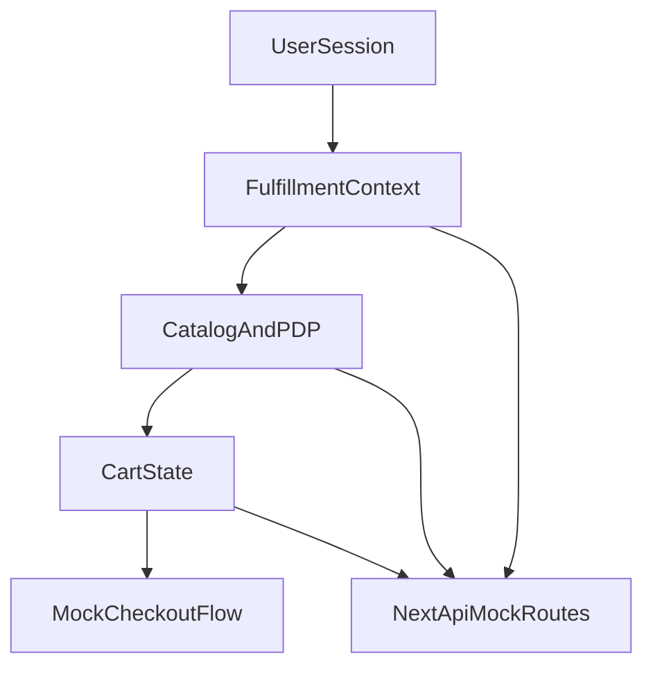

# Georgetown Cupcake Replica Plan (Next.js + Full Mock)

## Baseline and Constraints

- Current workspace is fully indexed: `[C:/Users/Jxsti/gtowncupcakervrsengineer/index.html](C:/Users/Jxsti/gtowncupcakervrsengineer/index.html)`, `[C:/Users/Jxsti/gtowncupcakervrsengineer/script.js](C:/Users/Jxsti/gtowncupcakervrsengineer/script.js)`, `[C:/Users/Jxsti/gtowncupcakervrsengineer/styles.css](C:/Users/Jxsti/gtowncupcakervrsengineer/styles.css)`, all empty.
- Rebuild target: public site structure and behavior patterns inferred from `georgetowncupcake.com`, including fulfillment-mode gating, catalog/filters, builder flows, cart logic, FAQ/content pages, and mock account/checkout states.
- Asset rule: no brand media reuse; use generic cupcake placeholders and neutralized copy where needed.

## Target Architecture

- Use Next.js App Router + TypeScript as the app shell.
- Keep server-side mocks inside API routes (`app/api/**`) for deterministic behavior without external services.
- Centralize domain logic in typed modules (`lib/domain/**`) so UI and APIs share the same rules (ZIP validation, date windows, availability, builder constraints).
- Build page-level composition with reusable blocks (`components/layout`, `components/catalog`, `components/fulfillment`, `components/builder`, `components/cart`, `components/forms`).

## Systematic Build Phases

### Phase 1: Project bootstrap and indexing guardrail

- Replace static scaffold with Next.js project structure.
- Add `docs/site-map.md` and `docs/parity-checklist.md` to explicitly track every replicated section/page/flow.
- Add `scripts/index-report.ts` that outputs all project files and key route/module counts, then wire `npm run index:report`.
- Acceptance gate: index report succeeds and parity checklist initialized before feature implementation.

### Phase 2: Global shell + content backbone

- Implement top-level layout: header/nav, footer, newsletter band, utility banners, and responsive behavior.
- Build route skeletons for major page families:
  - Home
  - Collections (all + themed)
  - Product detail
  - Local orders / Ship nationwide
  - FAQ / About / Contact / Corporate gifting / Special events / Employment
  - Blog index/tag/article mocks
  - Cart / Checkout (mock) / Account (mock)
- Seed placeholder image system in `public/images/cupcakes/**` and central image map in `lib/data/media.ts`.

### Phase 3: Domain model and mock API layer

- Implement typed entities: product, flavor, collection, availability calendar, fulfillment mode, ZIP profile, location, cart, customer/account, FAQ/content blocks.
- Create static seed data in `lib/data/**` including enough products/tags to emulate filter complexity.
- Create API routes for:
  - fulfillment resolution (`/api/fulfillment/resolve`)
  - availability lookup (`/api/availability`)
  - catalog querying (`/api/catalog`)
  - builder validation (`/api/builder/validate`)
  - cart ops (`/api/cart/*`)
  - checkout/account mock ops (`/api/checkout/*`, `/api/account/*`)
- Keep rules deterministic and testable (same inputs => same outputs).

### Phase 4: Fulfillment-first funnel (core behavioral parity)

- Build persistent fulfillment context (local vs nationwide, ZIP, date, delivery/pickup, location) with URL-safe/state-safe hydration.
- Enforce gating messages and branch logic across home, collection cards, and PDP CTA states.
- Implement date-window and serviceability errors to mirror observed UX patterns (not available today, choose a new day, incompatible delivery method constraints).

### Phase 5: Catalog, filters, and PDP

- Build collection pages with multi-dimensional filtering (category/flavor/occasion/holiday/popularity) and paginated grids.
- Add product card badges, ways-to-buy CTA behavior, and fulfillment-aware availability text.
- Implement PDP variants for standard products and special types (dozen packs, single cupcakes, merch/workshops, gift cards).

### Phase 6: Custom Dozen + Flavor Bar builders

- Implement 12-slot builder state machine with quantity accounting and per-flavor max constraints.
- Add sortable flavor list, selected-box preview, constraint errors, and add-to-cart transition.
- Ensure builder validation is server-backed by mock API (same rule engine as frontend).

### Phase 7: Cart, checkout, and account mocks

- Cart drawer/page with line-item editing, fulfillment conflict checks, and summary calculations.
- Mock checkout screens: contact/shipping, delivery method, payment placeholder, review/place-order.
- Mock account: sign-in/up states, order history, profile, loyalty-like points placeholder.
- Add customization placeholders (gift note and image/logo upload metadata handling in mock flow).

### Phase 8: Quality, parity audit, and hardening

- Write unit tests for domain rules and API handlers.
- Write component/integration tests for critical flows (fulfillment gating, filters, builder, cart conflicts).
- Run final parity pass against `docs/parity-checklist.md` with explicit pass/fail notes per section and interaction.
- Optimize performance/accessibility basics (image sizing, semantic landmarks, keyboard nav, error messaging clarity).

## Key Files To Create/Own Early

- `[C:/Users/Jxsti/gtowncupcakervrsengineer/docs/site-map.md](C:/Users/Jxsti/gtowncupcakervrsengineer/docs/site-map.md)`
- `[C:/Users/Jxsti/gtowncupcakervrsengineer/docs/parity-checklist.md](C:/Users/Jxsti/gtowncupcakervrsengineer/docs/parity-checklist.md)`
- `[C:/Users/Jxsti/gtowncupcakervrsengineer/lib/domain/fulfillment.ts](C:/Users/Jxsti/gtowncupcakervrsengineer/lib/domain/fulfillment.ts)`
- `[C:/Users/Jxsti/gtowncupcakervrsengineer/lib/domain/availability.ts](C:/Users/Jxsti/gtowncupcakervrsengineer/lib/domain/availability.ts)`
- `[C:/Users/Jxsti/gtowncupcakervrsengineer/lib/domain/builder.ts](C:/Users/Jxsti/gtowncupcakervrsengineer/lib/domain/builder.ts)`
- `[C:/Users/Jxsti/gtowncupcakervrsengineer/app/api/catalog/route.ts](C:/Users/Jxsti/gtowncupcakervrsengineer/app/api/catalog/route.ts)`
- `[C:/Users/Jxsti/gtowncupcakervrsengineer/app/api/cart/route.ts](C:/Users/Jxsti/gtowncupcakervrsengineer/app/api/cart/route.ts)`
- `[C:/Users/Jxsti/gtowncupcakervrsengineer/app/(shop)/collections/all/page.tsx](C:/Users/Jxsti/gtowncupcakervrsengineer/app/(shop)`/collections/all/page.tsx)
- `[C:/Users/Jxsti/gtowncupcakervrsengineer/app/(shop)/products/[handle]/page.tsx](C:/Users/Jxsti/gtowncupcakervrsengineer/app/(shop)`/products/[handle]/page.tsx)
- `[C:/Users/Jxsti/gtowncupcakervrsengineer/components/builder/custom-dozen-builder.tsx](C:/Users/Jxsti/gtowncupcakervrsengineer/components/builder/custom-dozen-builder.tsx)`

## Delivery Strategy

- Build in vertical slices with runnable checkpoints after each phase.
- Keep strict separation between presentation and rule logic to prevent drift in fulfillment/cart behavior.
- Track parity continuously in checklist form so “top-to-bottom replication” remains measurable rather than subjective.

