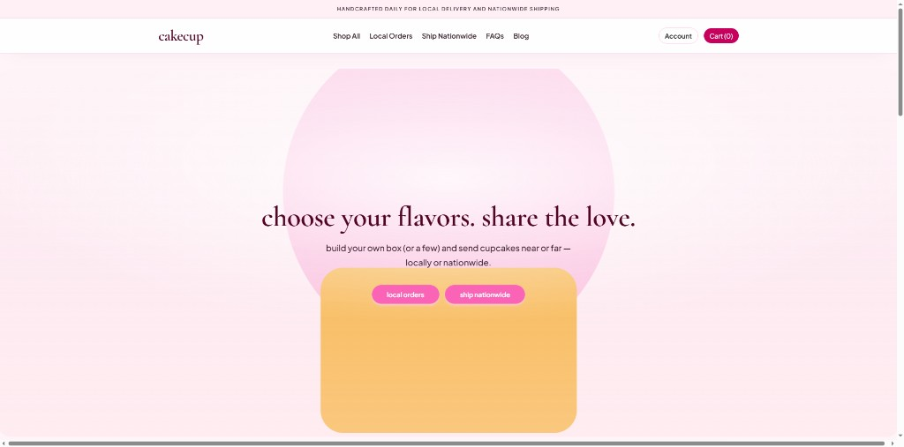
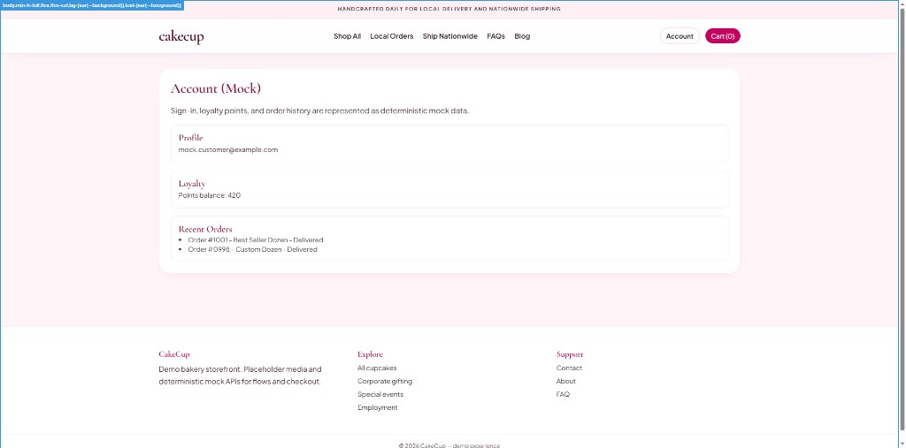
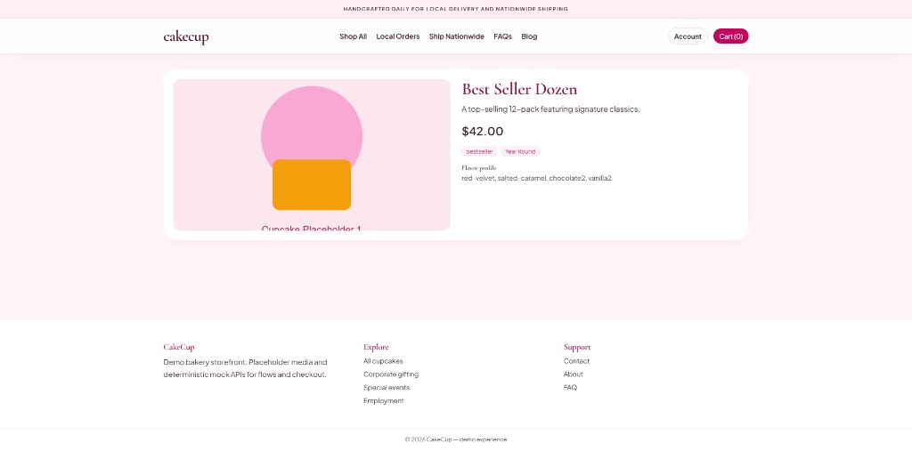
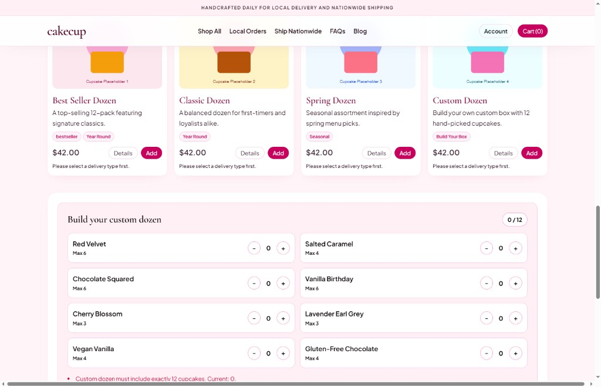
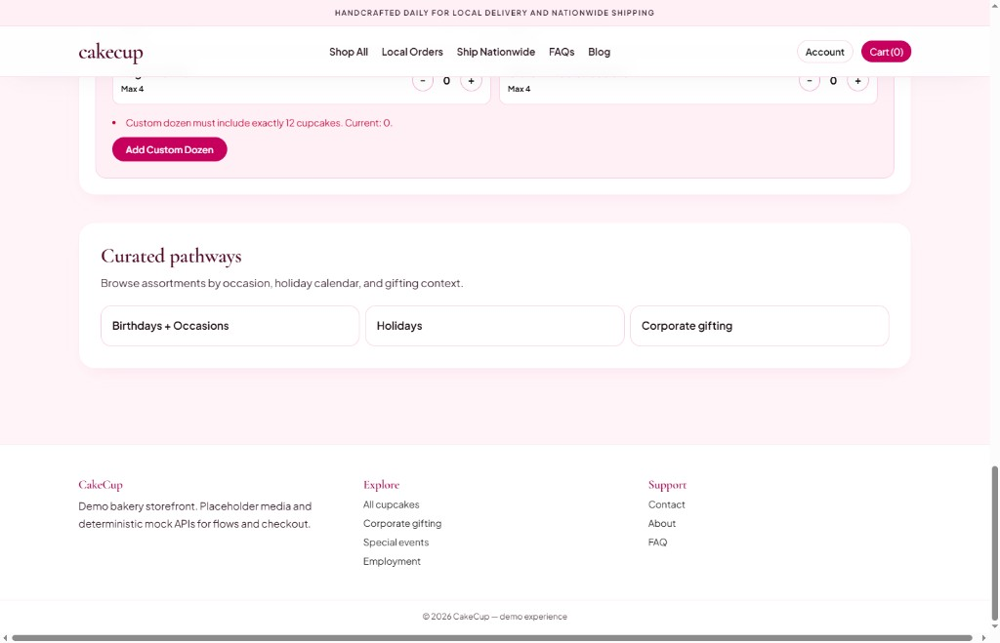

# CakeCup Storefront Replica

Next.js storefront prototype for local delivery and nationwide cupcake shipping.  
Includes a hero parallax, catalog browsing, account/cart pages, and deterministic mock APIs for checkout flows.

## UI Screenshots

Images live in the repo under `docs/screenshots/` so they render in GitHub, VS Code, and any Markdown preview that resolves paths relative to this file.

### Home hero


### Account page


### Product detail


### Catalog and custom dozen builder


### Builder + curated pathways section


## Run Locally

```bash
npm install
npm run dev
```

App runs at [http://localhost:3000](http://localhost:3000).

## Production

```bash
npm run build
npm start
```

`npm start` requires a completed `.next` production build from `npm run build`.
